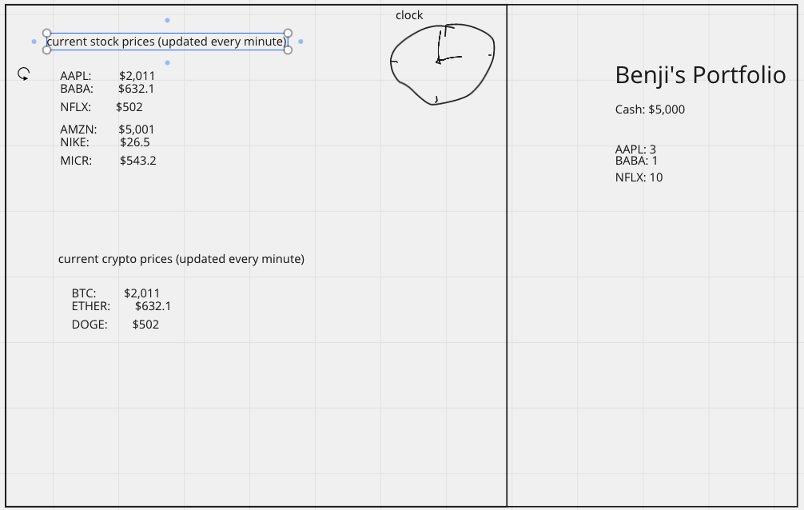

# Project 2 Pitch Guidelines
Project Description and Pitch Guidelines for SEIR SEA P2

---
## Project 2 Goals

In your second project you will create a full stack Express and Postgres app which has:
- *At least x2 models, and utilize and build at least one relationship between the two models.*
- *Sequelize as an ORM to interact with and create your database.*
- *An Express server utilizing EJS/EJS layouts for UI design and styling.*
- *Interaction with and inclusion of at least one API.*

## Project 2 Pitch Guidelines

In designing and building your project, you will start by forking and cloneing this repository, and then editing this README to include the following information: 
1. Name of your app: 

2. Tech stack you plan to use
     - HTML
     - Vanilla CSS
     - Javascript
     - Express
     - Postgress
     - Sequelize

3. Simple wireframes
     * Can be handdrawn, or with tool of your choice
     * Example online tool: [Miro.com](https://miro.com/)
     

5. API you plan to use
     - https://financialmodelingprep.com/

6. Example of how to call/invoke your API, and a description of what data comes back. 
     - https://financialmodelingprep.com/api/v3/quote/BTCUSD?apikey=#####
     - this will bring back the current price of bitcoin

7. MVP goals (x3-5)
     - pull and display current crypto prices on page via api
     - pull and display current user crypto and cash via postgres db
     - have ability to purchase additional crypto with cash at current price

8. Stretch goals (x2-5)
     - add stocks
     - add clock to emphasize how often prices change
     - add cash target and track how much time it takes to get there
     - add section which displays what you can buy with one bitcoin at the current price via a secondary product price api
     - add gamemode where it'll use past data to speed up price changes

9. Any potential roadblocks?
     - frequency of prices updates
     - api request restrictions
     - frequent updates to postgres db tables such as cash

## How to get started
1. **Fork and clone this repository.**
2. **Edit the text above to include specifics of your project.**
3. **Commit, push, and submit a pull request to this repo with your edited pitch README.**
4. *After you have met with a staff member and your pitch has been approved, suggested next steps:*
      * Write out your routes and create a RESTful routing chart (good example [here](https://gk-hynes.github.io/restful-routes-chart/)).
      * Come up with a breakdown of what you plan to accomplish each day and how you are going to accomplish it.
      * Create a new git repo for your project. 
      * Make all test API calls you need to to ensure your API will be usable for this project. 
      

